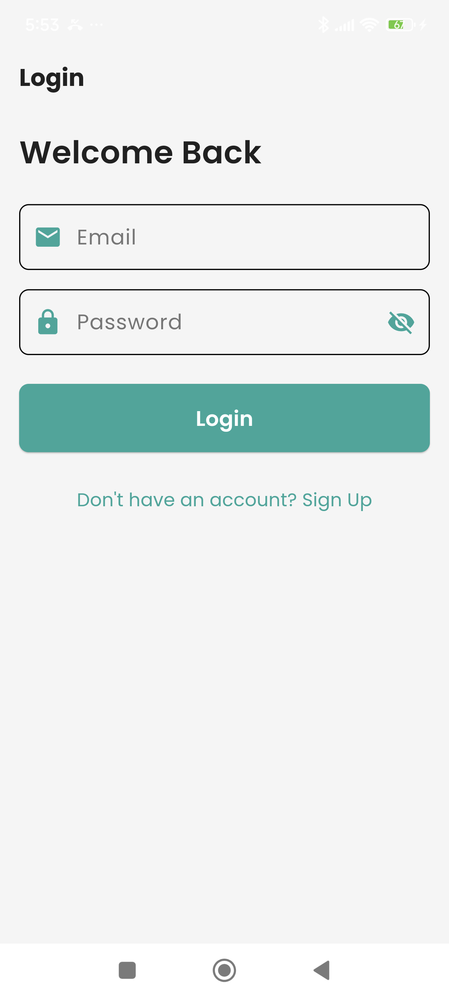
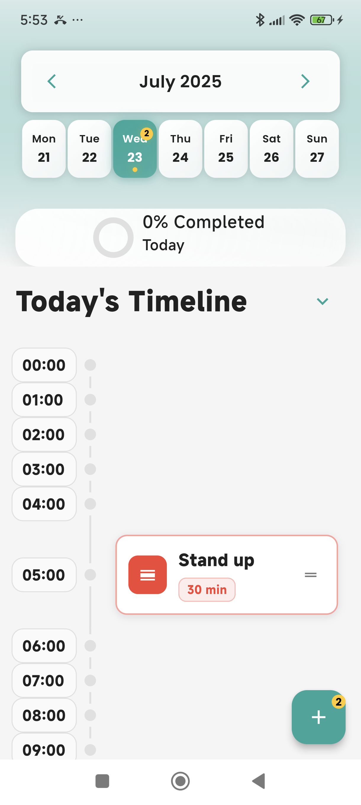
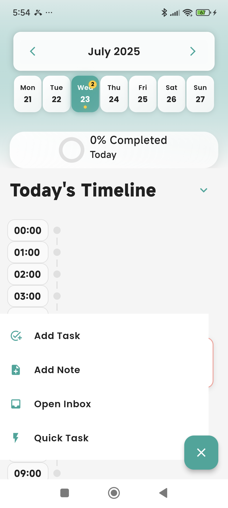
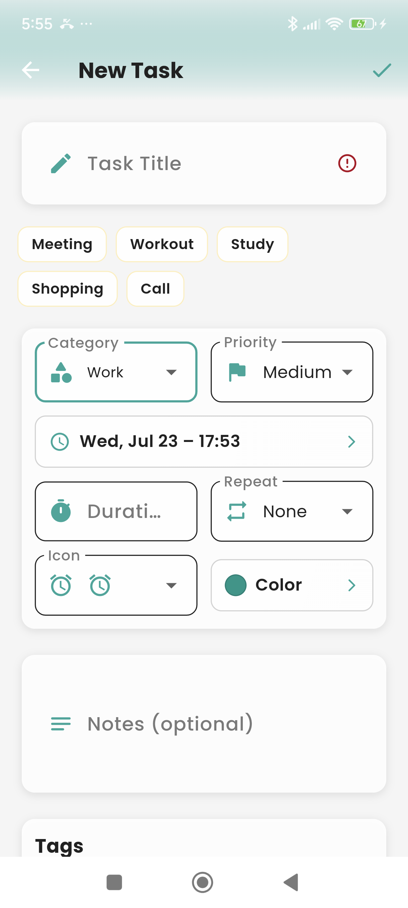
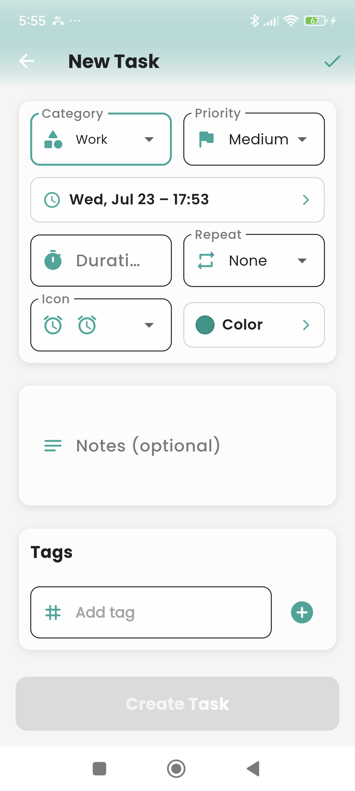
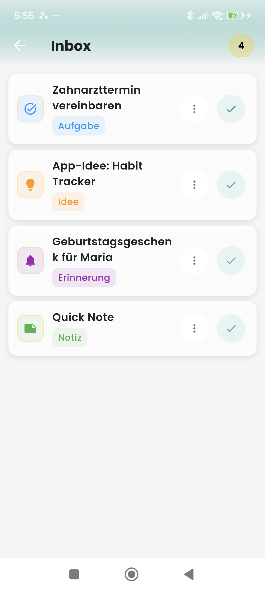

# 📱 Flutter App – Rebuild of **Structured**

This Flutter app is a **rebuild of the popular app [Structured](https://structured.app)**.  
The goal is to recreate its user interface and functionality as a personal project for learning UI/UX design and app architecture.

---

## 🔍 Preview

### 🔐 Login Screen

### 🏠 Home Screen

### ➕ Home Screen with Floating Action Button

### 📝 Add New Task – Step 1

### 📝 Add New Task – Step 2

### 📥 Inbox

---

## ⚠️ Disclaimer

This is **not an official clone or affiliated product**.  
It is a fan-made rebuild inspired by the design and concept of the **Structured** app, built for educational and experimental purposes.
